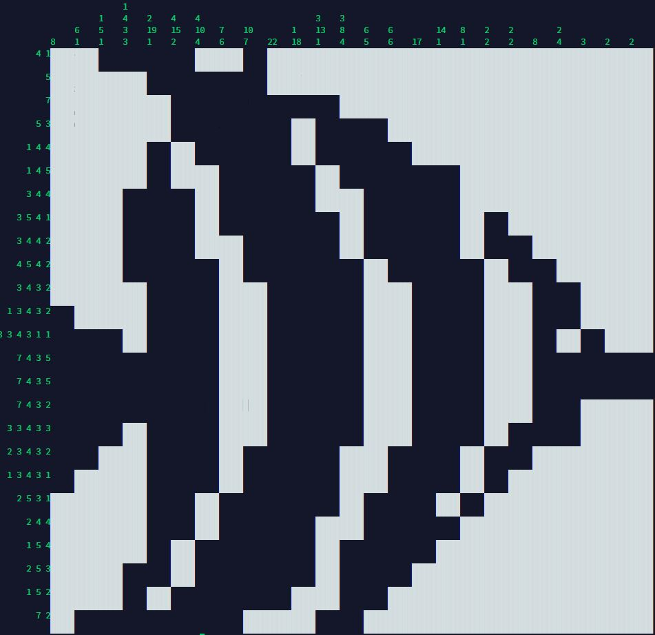

# Paint By Numbers Solver
Project members: Elena Kuznetsov

A rust implementation of a Paint By Numbers solver for CS410.
## Description
Paint By Numbers: Also known as Picross, Nonograms, are picture logic puzzles in which cells in a grid must be colored or left blank according to numbers at the side of the grid to reveal a hidden picture.

The goal of this project was to create a solver that quickly finds solutions for any given paint by numbers puzzle, this is achieved by providing the puzzle related information (numbers at the side of the grid) in a separate text file, which is then read, and printed in the terminal if a solution exists. 
## Format
The format for the text file:
-   dimensions on the first line, separated by a comma
-   followed by the numbers at the top of the grid, each key set on one line, separated by a comma.
-   followed by the numbers at the side of the grid, following the same format.

## Compiling and Running
This project is built and ran with "cargo build" in the root of the project (one level above /src/), which then allows the user to select one of the 7 available puzzles. Example (puzzle #1):

## Testing
All of the critical functions used for solving every puzzle are tested using a simpler representation of a Paint By Numbers puzzle, making sure that the logic results in expected behavior. These tests are located towards the bottom of /src/main.rs.

## Closing Remarks
Overall, this code works well for medium sized puzzles (30 by 30), but puzzles any larger than that begin taking a large amount of time to solve, such as puzzle #8 which takes so long to resolve that I gave up after waiting an hour. There are many optimizations that can be implemented with more time, and additional features that I wasn't able to get around to, such as colored puzzles rather than just b&w, and the ability to link any Paint by Numbers puzzle with a URL rather than manually providing a txt file. 

